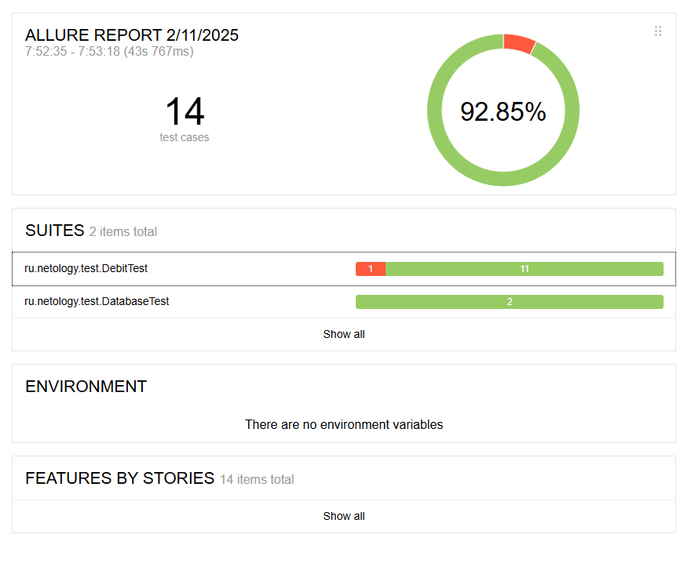

# Отчет о проведенном тестировании
## Краткое описание
Было проведено автоматизированное тестирование сервиса "Путешествие дня" для приобретения тура
с онлайн-оплатой картой и оплатой в кредит.
Было проведено ручное тестироваение, составлен план для автоматизированного тестирования, в соответствии с составленным планом автоматизации разработаны автотесты, составлены отчеты о проведенном автоматизированном и ручном тестировании.
Было составлено 8 [issue](https://github.com/Sad-Froggy/Neto_aqa-qamid-term/issues).

### Количество тест-кейсов:
Было автоматизировано 14 тест-кейсов:
* UI-тестов - 12
* тестов проверяющих информацию в БД - 2

### Процент успешных и не успешных тест-кейсов

Кол-во успешных тест-кейсов: 13 (92.85%);
Кол-во неуспешных тест-кейсов: 1 (17,15%);

#### Общие рекомендации:
Текущая версия тестируемого приложения не рекомендуется к релизу до исправления дефектов, описанных в Issues. Рекомендуется добавить уникальные идентификаторы на поля формы (data-test-id), для упрощения и ускорения процесса автоматизации.
